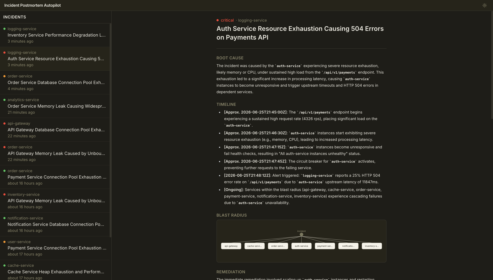
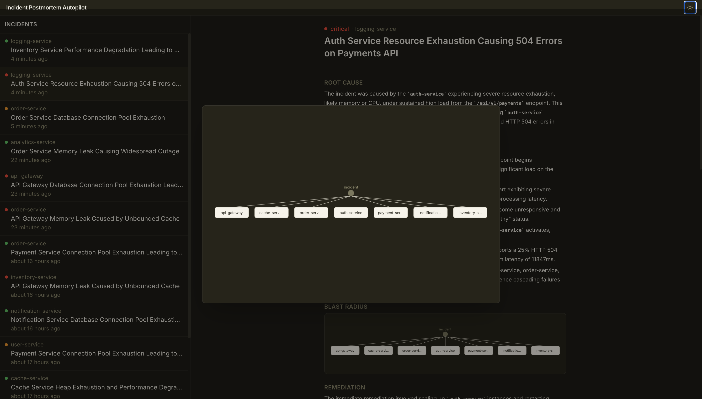
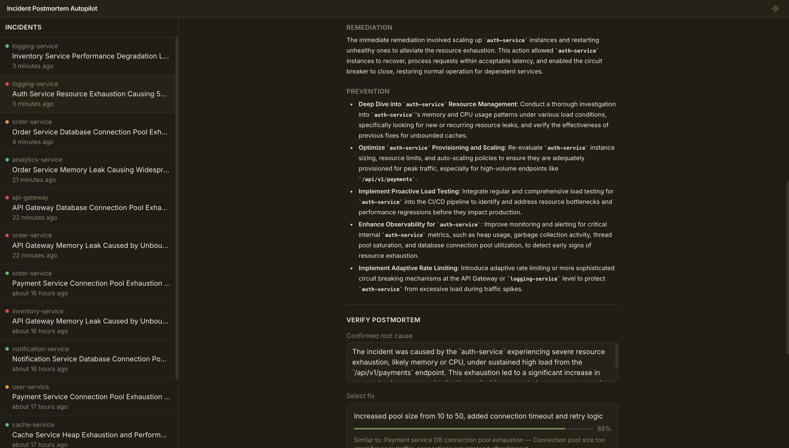
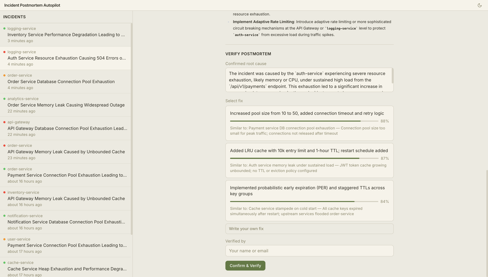
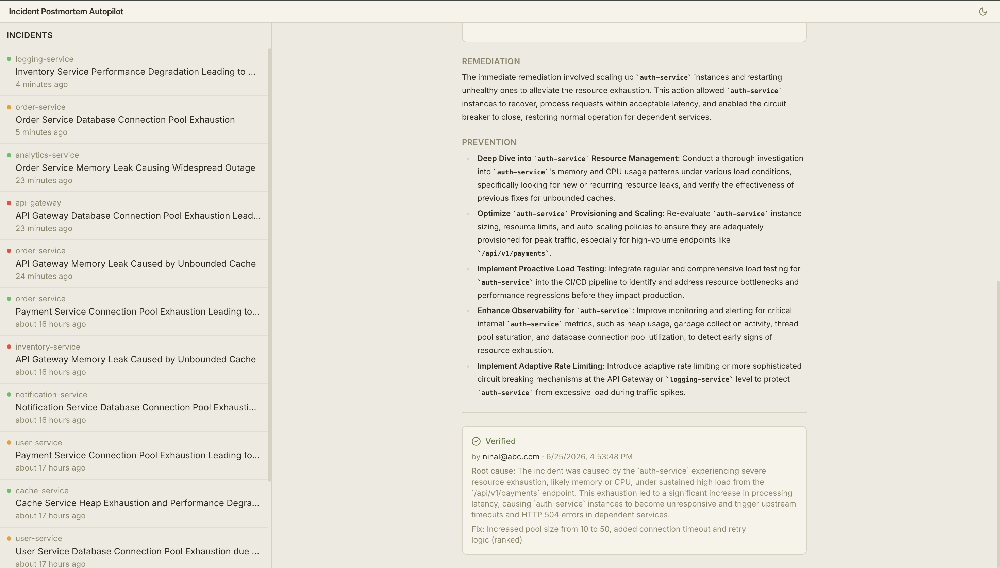

# Incident Postmortem Autopilot

An event-driven multi-agent system that autonomously generates incident postmortems from Kafka alerts. A Kafka alert fires, four specialized agents triage, correlate, analyse, and write — a structured postmortem lands in Redis and is immediately queryable through a FastAPI REST layer and a React UI, all within one windowed processing cycle.

---

## Table of Contents

- [Screenshots](#screenshots)
- [Architecture](#architecture)
- [Agent Pipeline](#agent-pipeline)
- [Human Verification Loop](#human-verification-loop)
- [Stack](#stack)
- [Key Design Decisions](#key-design-decisions)
- [File Structure](#file-structure)
- [Prerequisites](#prerequisites)
- [Cloning and Running](#cloning-and-running)
- [Environment Variables](#environment-variables)
- [API Reference](#api-reference)
- [Frontend](#frontend)
- [Observability](#observability)
- [Testing](#testing)
- [Known Limitations](#known-limitations)

---

## Screenshots

### Incident Feed + Postmortem Detail

The left sidebar lists every generated postmortem, labelled by affected service and severity. Clicking an incident loads the full postmortem — root cause, timeline, blast radius map, remediation, and prevention steps — in the main panel.



---

### Blast Radius Graph

Clicking the inline blast radius map expands it into a full-screen D3 hub-and-spoke visualisation. The central node is the incident service; spokes radiate outward to every transitively affected downstream service (up to 3 hops in Neo4j).



---

### Remediation, Prevention + Verify Panel

Scrolling down reveals the AI-generated remediation steps and structured prevention recommendations, followed by the verification panel where an engineer confirms the root cause and selects a fix.



---

### Fix Candidate Selection

The verify panel surfaces up to three semantically deduplicated fix suggestions ranked by cosine similarity to past verified incidents. Each candidate shows a confidence score and a "Similar to:" citation. Engineers can select one, or write a custom fix not in the list.



---

### Verified Postmortem

Once submitted, the postmortem is marked `Verified` with the engineer's identity and timestamp. The confirmed root cause and chosen fix are persisted to Weaviate, closing the feedback loop for future correlation.



---

## Architecture

```
┌──────────────────────────────────────────────────────────────────────┐
│                         Incident Simulator                           │
│                    (Kafka producer — alerts topic)                   │
└──────────────────────────────────┬───────────────────────────────────┘
                                   │  alert JSON
                                   ▼
┌──────────────────────────────────────────────────────────────────────┐
│            Agent Pipeline  (windowed Kafka consumer)                 │
│                                                                      │
│  AlertBatcher — 30 s tumbling window, 100-alert cap per service      │
│       │                                                              │
│       ▼  (on window close, per-service batch)                        │
│  TriageAgent ──── Neo4j ──────▶ severity + blast radius              │
│       │                                                              │
│       ▼                                                              │
│  CorrelationAgent ── Gemini embed ── Weaviate ──▶ top-3 past cases  │
│       │                                                              │
│       ▼                                                              │
│  RCAAgent ── DSPy ChainOfThought / Gemini ──▶ root cause analysis   │
│       │                                                              │
│       ▼                                                              │
│  PostmortemWriter ── DSPy Predict ──▶ structured postmortem          │
│       │               └─ Weaviate (deduped ranked fix candidates)   │
│       │                                                              │
└───────┼──────────────────────────────────────────────────────────────┘
        │  postmortem JSON
        ▼  (postmortems topic)
┌──────────────────────────────────────────────────────────────────────┐
│                    FastAPI  (REST + Prometheus /metrics)              │
│                         │                                            │
│                      Redis  (TTL cache, AOF persistence)             │
└──────────────────────────────────┬───────────────────────────────────┘
                                   │  HTTP
                                   ▼
┌──────────────────────────────────────────────────────────────────────┐
│              React UI  (Vite + Tailwind + D3)                        │
│   Incident feed · Postmortem detail · Blast radius graph · Verify   │
└──────────────────────────────────────────────────────────────────────┘
```

### Data flow

1. The simulator (or any Kafka producer) publishes an alert to the `alerts` topic.
2. The pipeline accumulates alerts per-service in a 30-second tumbling window.
3. When the window closes the batch is passed through all four agents in sequence.
4. The resulting postmortem is published to the `postmortems` topic.
5. The FastAPI server consumes `postmortems` on a background thread and caches each one in Redis.
6. The React UI polls `GET /postmortems` and renders the feed; clicking an incident loads the full postmortem and interactive blast radius graph.

---

## Agent Pipeline

### AlertBatcher

Accumulates raw Kafka messages into per-service buckets over `WINDOW_SIZE_SECONDS` (default 30 s). Hard cap of `MAX_ALERTS_PER_WINDOW_PER_SERVICE` (default 100) per bucket — excess alerts are dropped with a warning. Flushing is time-driven, not message-count-driven, so a quiet service never blocks a busy one.

### TriageAgent

- Maps raw severity codes to human labels: `P1 → critical`, `P2 → high`, `P3 → medium`.
- Executes a 3-hop Neo4j Cypher traversal over `DEPENDS_ON | CALLS` edges to build the blast radius (all services transitively affected).
- Gracefully degrades to an empty blast radius if Neo4j is unreachable.

### CorrelationAgent

- Concatenates all alert messages and service names in a batch into a single query string (capped at 4 096 chars).
- Embeds the query **once** per batch using Gemini `gemini-embedding-001` — not once per alert — to avoid redundant API calls.
- Over-fetches up to 10 candidate incidents from Weaviate, then applies two-phase deduplication (exact normalized title match, then Jaccard similarity ≥ 0.85) before returning the top 3 unique results.
- Retries Gemini 429 responses up to 5 times with exponential backoff (1 s – 60 s) via Tenacity.

### RCAAgent

- Runs `DSPy ChainOfThought` individually per alert, feeding `alert_data`, `blast_radius`, and `correlated_incidents` as context.
- Input fields are hard-truncated (service: 128 chars, message: 2 048 chars, blast radius: 512 chars, correlated: 2 048 chars) to stay within token limits.
- Falls back to `"RCA unavailable due to processing error"` on failure so the batch continues.

### PostmortemWriter

- Runs `DSPy Predict` with a typed `PostmortemSignature` to generate title, root cause, timeline, remediation, and prevention fields.
- Over-fetches up to 10 candidate fixes from Weaviate, deduplicates with the same two-phase strategy (exact match + Jaccard ≥ 0.85), and returns up to 3 semantically unique `FixCandidate` objects ranked by confidence (derived from cosine distance: `1.0 − distance / 2.0`). Fewer than 3 are returned when not enough unique fixes exist — no padding with duplicates.
- Validates all required output fields before publishing; raises on missing fields rather than silently emitting incomplete postmortems.
- Calls `producer.flush()` **once** per batch (not once per message) to reduce network overhead.

---

## Human Verification Loop

AI-generated postmortems are cached in Redis but **never** written to Weaviate until a human verifies them. The `PATCH /postmortems/{incident_id}/verify` endpoint:

1. Accepts `confirmed_root_cause` + one of: `selected_fix_index` (any non-negative integer, bounds-checked at runtime against the actual number of suggestions), `custom_fix` (freeform), or `confirmed_fix` (deprecated alias for `custom_fix`).
2. Embeds the confirmed root cause + fix via Gemini and upserts a `PastIncident` document into Weaviate.
3. Marks the postmortem `verified=true` in Redis.
4. Returns 409 if already verified — preventing duplicate Weaviate writes (Weaviate has no uniqueness constraint; Redis is the dedup gate).

Weaviate is written **before** Redis is updated, so a Weaviate failure never leaves a postmortem marked verified without actual persistence.

This feedback loop means every human correction improves future correlation and fix ranking for similar incidents.

---

## Stack

| Layer | Technology | Role |
|---|---|---|
| Event streaming | Confluent Kafka 7.5 | `alerts` and `postmortems` topics |
| Stream coordinator | Zookeeper 7.5 | Kafka cluster coordination |
| Vector database | Weaviate 1.24 | Semantic incident correlation + fix ranking |
| Graph database | Neo4j 5.18 | Service dependency graph (blast radius) |
| LLM orchestration | DSPy 2.5 | Structured RCA and postmortem generation |
| LLM + embeddings | Gemini 2.5 Flash / gemini-embedding-001 | Language model and vector embeddings |
| Caching | Redis 7.2 (AOF) | Postmortem TTL cache with persistence |
| API | FastAPI 0.115 + Uvicorn | REST endpoints + Prometheus metrics |
| Frontend | React 18 + Vite + Tailwind CSS | Incident browsing and verification UI |
| Visualization | D3 (inline SVG) | Blast radius graph |
| Testing (Python) | pytest + unittest.mock | 213 tests |
| Testing (frontend) | Vitest 2 + React Testing Library | 64 tests |

---

## Key Design Decisions

**Windowed batch processing** — Alerts are grouped by service over a 30-second window before any LLM calls. This means one embedding call and one Kafka flush per batch regardless of how many alerts arrive, which dramatically reduces API cost and latency under burst traffic.

**Single embedding per batch** — The CorrelationAgent embeds a concatenated query for the entire service batch rather than embedding each alert individually. For a 10-alert burst on one service this is a 10× reduction in Gemini API calls.

**Two-phase deduplication** — Both CorrelationAgent and PostmortemWriter over-fetch 10 candidates from Weaviate, then filter with exact normalized text matching followed by Jaccard token similarity (threshold ≥ 0.85). This prevents near-duplicate past incidents or fix suggestions from dominating the results.

**Stateless agents** — Each agent takes a dict in and returns an enriched dict out. No shared state between agents. This makes the pipeline trivially testable and easy to replace individual agents.

**DSPy over raw prompts** — DSPy's `Predict` and `ChainOfThought` provide typed input/output contracts and automatic prompt compilation, so output structure is enforced by the framework rather than fragile string parsing.

**Weaviate write ordering** — In the verification endpoint, Weaviate is written before Redis is updated. A crash between the two leaves a postmortem unverified (safe to retry) rather than verified without persistence.

**Redis as verification gate** — Weaviate has no uniqueness constraint. Redis stores the `verified` flag and the 409 check runs against it, ensuring exactly one Weaviate document per incident.

**CSS custom property for sidebar width** — The resizable sidebar uses `--sidebar-w` as a CSS variable applied at the `md:` breakpoint only (`md:w-[var(--sidebar-w)]`), so the mobile `w-80` fixed-drawer width is never overridden by the desktop resize state.

**Embedding model** — `gemini-embedding-001` is used throughout. `text-embedding-004` is not available on all Google Cloud projects; using the wrong model causes silent 404 errors from the Gemini API.

**LiteLLM prefix** — DSPy routes through LiteLLM. The correct prefix is `gemini/` (not `google/`, which routes to Vertex AI and requires different auth).

---

## File Structure

```
incident_postmortem/
│
├── agents/                         # Multi-agent pipeline
│   ├── pipeline.py                 # Kafka consumer loop, windowed AlertBatcher, orchestration
│   ├── triage_agent.py             # Severity classification + Neo4j blast radius
│   ├── correlation_agent.py        # Gemini embedding + Weaviate semantic search + dedup
│   ├── rca_agent.py                # DSPy ChainOfThought root cause analysis
│   └── postmortem_writer.py        # DSPy Predict postmortem + deduped fix ranking + Kafka publish
│
├── api/
│   └── main.py                     # FastAPI app: lifespan, REST endpoints, Redis cache,
│                                   # Kafka consumer thread, verify endpoint, Prometheus
│
├── infra/                          # Infrastructure client factories
│   ├── kafka_client.py             # Confluent Kafka producer/consumer factories
│   ├── neo4j_client.py             # Neo4j driver factory + schema seeding
│   ├── redis_client.py             # Redis connection pool factory
│   └── weaviate_client.py          # Weaviate client factory (gRPC + HTTP)
│
├── simulator/
│   └── incident_simulator.py       # Kafka alert producer for local testing
│
├── data/
│   ├── past_incidents.json         # Curated seed incidents (single source of truth)
│   └── seed_weaviate.py            # Seeds 5 historical incidents into Weaviate with embeddings
│
├── scripts/
│   └── clean_weaviate.py           # Weaviate maintenance CLI (list / delete / wipe-and-reseed)
│
├── screenshots/                    # UI screenshots for documentation
│
├── frontend/                       # React UI
│   ├── src/
│   │   ├── App.jsx                 # Root layout, theme, drawer state, sidebar width state
│   │   ├── components/
│   │   │   ├── IncidentFeed.jsx    # Sidebar incident list, mobile drawer, drag-to-resize handle
│   │   │   ├── PostmortemDetail.jsx # Full postmortem view with markdown rendering
│   │   │   ├── BlastRadiusGraph.jsx # D3 SVG hub-and-spoke service dependency graph
│   │   │   ├── FixCandidateList.jsx # Ranked AI fix suggestions (select or write custom)
│   │   │   └── VerifyPanel.jsx     # Human verification form (PATCH /verify)
│   │   ├── hooks/
│   │   │   ├── usePostmortems.js   # Polls GET /postmortems
│   │   │   └── usePostmortem.js    # Fetches single postmortem by ID
│   │   ├── context/
│   │   │   └── ThemeContext.jsx    # Light/dark theme toggle
│   │   ├── test/
│   │   │   └── integration/
│   │   │       └── App.test.jsx    # 11 integration tests (drawer, sidebar resize, theme)
│   │   └── index.css               # Tailwind base + safe-area inset utilities
│   ├── tailwind.config.js          # Custom design tokens (pm-* colour palette)
│   ├── vite.config.js
│   └── vitest.config.ts
│
├── tests/                          # Python test suite (213 tests)
│   ├── conftest.py
│   ├── test_pipeline.py            # Pipeline, AlertBatcher, windowing logic
│   ├── test_api.py                 # FastAPI endpoints + verify logic
│   ├── test_triage_agent.py
│   ├── test_correlation_agent.py
│   ├── test_rca_agent.py
│   ├── test_postmortem_writer.py
│   ├── test_kafka_client.py
│   ├── test_neo4j_client.py
│   ├── test_weaviate_client.py
│   ├── test_redis_client.py
│   ├── test_logging_config.py
│   ├── test_metrics.py
│   ├── test_incident_simulator.py
│   └── test_seed_weaviate.py
│
├── logging_config.py               # structlog JSON logging configuration
├── docker-compose.yml              # Kafka + Zookeeper + Weaviate + Neo4j + Redis
├── requirements.txt
├── .env.example
└── .gitignore
```

---

## Prerequisites

- **Python 3.11+**
- **Node.js 18+** (for the React frontend)
- **Docker + Docker Compose** (for the infrastructure stack)
- **Gemini API key** — free tier at [aistudio.google.com](https://aistudio.google.com)

---

## Cloning and Running

### 1. Clone

```bash
git clone https://github.com/NihalMishra17/Incident_Postmortem_Autopilot.git
cd Incident_Postmortem_Autopilot
```

### 2. Configure environment

```bash
cp .env.example .env
```

Open `.env` and set `GEMINI_API_KEY`. All other defaults work out of the box for local development.

### 3. Start infrastructure

```bash
docker compose up -d
```

This starts Zookeeper, Kafka, Weaviate (HTTP :8080, gRPC :50051), Neo4j (:7474, :7687), and Redis (:6379). All services have healthchecks — wait ~30 seconds for them to go green.

```bash
docker compose ps   # all should show "healthy"
```

### 4. Install Python dependencies

```bash
pip install -r requirements.txt
```

### 5. Seed data

```bash
# Create Neo4j service dependency graph
PYTHONPATH=. python infra/neo4j_client.py

# Seed Weaviate with 5 historical incidents (creates PastIncident schema + embeddings)
PYTHONPATH=. python data/seed_weaviate.py
```

Both scripts are idempotent — safe to re-run.

#### Weaviate maintenance

`scripts/clean_weaviate.py` lets you inspect and repair the `PastIncident` collection without touching Docker volumes:

```bash
# List all entries (UUID + title + fix preview)
PYTHONPATH=. python scripts/clean_weaviate.py --list

# Delete specific entries by UUID
PYTHONPATH=. python scripts/clean_weaviate.py --delete <uuid1> <uuid2>

# Wipe the collection and reseed from data/past_incidents.json
# ⚠️  Destructive — prompts for confirmation. Requires GEMINI_API_KEY.
PYTHONPATH=. python scripts/clean_weaviate.py --wipe-and-reseed
```

The curated seed data lives in `data/past_incidents.json`. Edit that file to change what gets seeded; both `seed_weaviate.py` and `clean_weaviate.py` read from it.

### 6. Start the agent pipeline

```bash
python -m agents.pipeline
```

For faster local feedback (5-second windows instead of 30):

```bash
WINDOW_SIZE_SECONDS=5 python -m agents.pipeline
```

Leave this running in a terminal. It will log each window flush and postmortem publish.

### 7. Start the API server

```bash
uvicorn api.main:app --reload
```

API is now available at `http://localhost:8000`. Interactive docs at `http://localhost:8000/docs`.

### 8. Start the frontend

```bash
cd frontend
npm install
npm run dev
```

UI is available at `http://localhost:5173`.

### 9. Generate test incidents

In a new terminal:

```bash
python simulator/incident_simulator.py --count 3 --interval 2
```

Within one window period (5 s if you used `WINDOW_SIZE_SECONDS=5`) you should see postmortems appear in the pipeline logs and in the UI feed.

Or trigger a single alert directly via the API:

```bash
curl -X POST http://localhost:8000/postmortems/trigger \
  -H "Content-Type: application/json" \
  -d '{"service": "auth-service", "severity": "P1", "description": "Spike in 5xx errors"}'
```

### 10. Query postmortems

```bash
curl http://localhost:8000/postmortems | python -m json.tool
curl http://localhost:8000/postmortems/{incident_id} | python -m json.tool
```

---

## Environment Variables

All variables have working defaults except `GEMINI_API_KEY`.

```bash
# Required
GEMINI_API_KEY=                         # Google AI Studio or Vertex AI key

# Gemini
GEMINI_MODEL=gemini-2.5-flash           # LLM model used by DSPy and PostmortemWriter

# Kafka
KAFKA_BOOTSTRAP_SERVERS=localhost:9092

# Neo4j
NEO4J_URI=bolt://localhost:7687
NEO4J_USER=neo4j
NEO4J_PASSWORD=neo4jpassword
NEO4J_AUTH=neo4j/neo4jpassword          # Used by docker-compose

# Weaviate
WEAVIATE_HOST=localhost
WEAVIATE_PORT=8080

# Redis
REDIS_HOST=localhost
REDIS_PORT=6379
REDIS_PASSWORD=
REDIS_TTL=86400                         # Postmortem cache TTL in seconds (default 24 h)

# Pipeline tuning
WINDOW_SIZE_SECONDS=30                  # Tumbling window duration (1–3600)
MAX_ALERTS_PER_WINDOW_PER_SERVICE=100   # Alerts per service per window before drop (1–10000)
SERVICE_BATCH_DELAY_SECONDS=1           # Delay between per-service LLM calls (0–10, rate limit buffer)

# API
CORS_ORIGINS=http://localhost:3000,http://localhost:5173
```

---

## API Reference

### `GET /postmortems`

Returns all postmortems currently cached in Redis.

```json
{
  "postmortems": [
    {
      "incident_id": "a1b2c3d4-...",
      "title": "Auth Service Complete Outage",
      "severity": "critical",
      "service": "auth-service",
      "affected_services": ["user-service", "api-gateway"],
      "root_cause": "...",
      "timeline": "...",
      "remediation": "...",
      "prevention": "...",
      "suggested_fixes": [
        { "fix": "...", "confidence": 0.92, "reasoning": "Similar to: ..." },
        { "fix": "...", "confidence": 0.75, "reasoning": "..." }
      ],
      "generated_at": "2026-06-21T10:00:00Z",
      "verified": false
    }
  ]
}
```

`suggested_fixes` contains up to 3 semantically unique candidates. Fewer than 3 are returned when the Weaviate corpus doesn't yield enough distinct results after deduplication.

### `GET /postmortems/{incident_id}`

Returns a single postmortem by ID. `404` if not in cache.

### `POST /postmortems/trigger`

Publishes an alert to Kafka and returns immediately. The pipeline processes it asynchronously.

**Request:**
```json
{
  "service": "payment-service",
  "severity": "P1",
  "description": "Elevated error rate on checkout endpoint"
}
```

**Response `202 Accepted`:**
```json
{ "alert_id": "...", "status": "queued" }
```

**Severity codes:** `P1` → critical, `P2` → high, `P3` → medium.

### `PATCH /postmortems/{incident_id}/verify`

Engineer verification. Accepts exactly one fix selection mode.

**Request (pick one fix mode):**
```json
{
  "confirmed_root_cause": "Connection pool exhausted due to ORM leak",
  "selected_fix_index": 0,
  "verified_by": "alice@example.com"
}
```
```json
{
  "confirmed_root_cause": "Connection pool exhausted due to ORM leak",
  "custom_fix": "Patched ORM connection cleanup and deployed hotfix",
  "verified_by": "alice@example.com"
}
```

| Field | Description |
|---|---|
| `confirmed_root_cause` | Required. Engineer-confirmed root cause (1–4096 chars). |
| `selected_fix_index` | Any non-negative integer. Selects from the AI-ranked `suggested_fixes` array; bounds-checked at runtime. |
| `custom_fix` | Freeform fix description not in the ranked list. |
| `confirmed_fix` | Deprecated alias for `custom_fix`, still accepted. |
| `verified_by` | Engineer identifier (email or username). |

**Error codes:**
| Code | Meaning |
|---|---|
| `400` | Invalid request (missing/multiple fix fields, index out of bounds) |
| `404` | Incident not found in Redis cache |
| `409` | Already verified (prevents duplicate Weaviate entries) |
| `503` | Redis, Weaviate, or Gemini unavailable |

### `GET /metrics`

Prometheus metrics (request latency, throughput, error rates). Restrict to internal networks in production.

### `GET /health`

Returns `{"status": "ok"}`.

---

## Kafka Topics

| Topic | Producer | Consumer | Key fields |
|---|---|---|---|
| `alerts` | Simulator / `POST /trigger` | Agent pipeline | `alert_id`, `service`, `severity`, `timestamp`, `message` |
| `postmortems` | PostmortemWriter | FastAPI background thread | `incident_id`, `title`, `root_cause`, `suggested_fixes`, `generated_at` |

Topics are auto-created by Kafka on first use (`KAFKA_AUTO_CREATE_TOPICS_ENABLE: "true"` in docker-compose).

---

## Weaviate Schema

**Collection:** `PastIncident`

| Property | Type | Description |
|---|---|---|
| `title` | `text` | Incident title |
| `root_cause` | `text` | Root cause description |
| `fix` | `text` | Fix applied |
| `service` | `text` | Affected service |

Vector representation: Gemini `gemini-embedding-001` (768 dimensions). Cosine distance metric.

Only two code paths write to Weaviate: `data/seed_weaviate.py` (initial seed) and `PATCH /verify` (human-verified postmortems). AI drafts are never written.

---

## Neo4j Schema

**Nodes:** `Service { name: string }`

**Relationships:** `DEPENDS_ON`, `CALLS`

The blast radius query traverses up to 3 hops in either direction:

```cypher
MATCH (s:Service {name: $service})-[:DEPENDS_ON|CALLS*1..3]-(affected:Service)
WHERE affected.name <> $service
RETURN DISTINCT affected.name AS name
```

---

## Frontend

The React UI requires no configuration — it talks to the API at `http://localhost:8000` (configurable in `vite.config.js`).

**Key components:**

| Component | File | Description |
|---|---|---|
| `App` | `App.jsx` | Root layout, theme toggle, mobile drawer state, sidebar width (persisted to localStorage) |
| `IncidentFeed` | `IncidentFeed.jsx` | Sidebar incident list. On mobile: full-screen drawer with slide animation. On desktop: resizable via drag handle (180–400 px, localStorage-persisted). |
| `PostmortemDetail` | `PostmortemDetail.jsx` | Full postmortem with ReactMarkdown rendering. Blast radius graph is clickable to open in a modal overlay. |
| `BlastRadiusGraph` | `BlastRadiusGraph.jsx` | D3 hub-and-spoke SVG. Hub = incident node. Spokes = affected services. Click inline graph to expand in a centered modal (620×360). |
| `FixCandidateList` | `FixCandidateList.jsx` | Up to three semantically deduplicated AI fix suggestions with confidence scores. Select one or write a custom fix. |
| `VerifyPanel` | `VerifyPanel.jsx` | `PATCH /verify` form. Strips markdown from the prefilled root cause textarea. |

**Mobile behaviour:** sidebar collapses to a hidden fixed drawer; hamburger icon opens it; selecting an incident closes it automatically; Escape key also closes it.

**Frontend dev commands:**

```bash
cd frontend
npm run dev        # start dev server at :5173
npm run build      # production build to frontend/dist/
npm run test       # run 64 Vitest tests once
npm run test:watch # watch mode
```

---

## Observability

### Structured logging

All Python code (agents + API) uses `structlog` with JSON output to stdout. Each log record includes `timestamp`, `level`, `event`, and contextual fields (service, incident_id, etc.). Container log aggregators (Datadog, Loki, CloudWatch) can index these directly.

### Prometheus metrics

`GET /metrics` exposes default FastAPI instrumentation via `prometheus-fastapi-instrumentator`:

- `http_requests_total` — request count by method, path, status
- `http_request_duration_seconds` — latency histogram by path

Scrape with any Prometheus-compatible collector. The `/metrics` endpoint itself is excluded from instrumentation to avoid cardinality bloat.

---

## Testing

### Python (213 tests)

```bash
# Run all tests
pytest

# Run with verbose output
pytest -v

# Run a specific module
pytest tests/test_pipeline.py -v

# Run with coverage
pytest --cov=. --cov-report=term-missing
```

Tests use `unittest.mock` throughout — no live infrastructure required. The test suite covers:
- Pipeline windowing logic and alert batching
- Each agent's processing and error handling, including deduplication scenarios
- FastAPI endpoint contracts (happy path, 400/404/409/500/503)
- Verification endpoint (all fix modes, dedup logic, runtime bounds checking, Weaviate ordering)
- Infrastructure client factories
- Weaviate maintenance CLI

### Frontend (64 tests)

```bash
cd frontend

# Run once
npm run test

# Watch mode
npm run test:watch
```

Coverage includes: `ThemeContext`, `BlastRadiusGraph`, `FixCandidateList`, `VerifyPanel`, `IncidentFeed` (including drawer open/close and severity colours), `PostmortemDetail`, `usePostmortems`, `usePostmortem`, and App integration (drawer, sidebar resize, theme toggle).

---

## Known Limitations

- **Single-instance pipeline** — One process, one Kafka consumer. Scale horizontally with consumer groups and multiple partitions.
- **No API authentication** — Endpoints are open. Add OAuth2 / API key middleware before any public deployment.
- **No rate limiting** — The API has no request throttling. Use a reverse proxy (nginx, Caddy) or API gateway in production.
- **Sequential agent processing** — Agents run one service batch at a time per window. Parallelise with `concurrent.futures` or a task queue for high-throughput scenarios.
- **Redis TTL expiry** — Verified postmortems expire from Redis after `REDIS_TTL` seconds (default 24 h). They remain in Weaviate permanently, but the REST API won't surface them after TTL. Extend TTL or add a secondary store for long-term retention.
- **Shared dedup utility** — Deduplication logic is implemented identically in both `CorrelationAgent` and `PostmortemWriter`. A future refactor will extract it to `agents/utils/dedup.py`.
